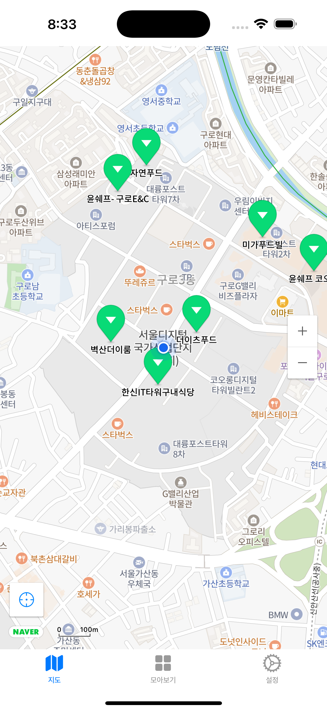
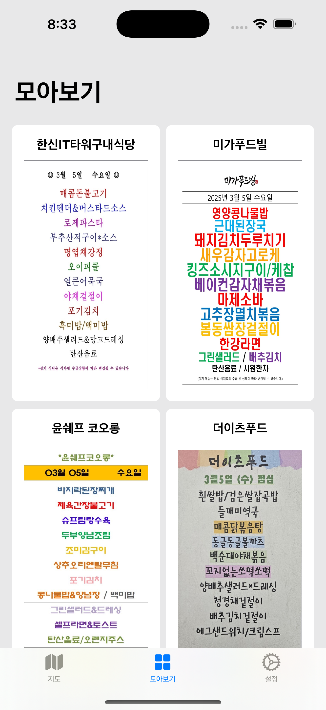

# 🏢 구로구내  
구로디지털단지 구내식당 메뉴 확인 앱  

구로디지털단지 인근 직장인과 거주자를 위한 구내식당 메뉴 정보 제공 서비스  

  

## 📱 Screenshots  

  
  
  

## 📱 Features  
- 지도 기반 구내식당 위치 표시  
- 식당별 오늘의 메뉴 정보 제공

## 🛠 Development Environment  
- iOS 16.0+  
- Xcode 16.0+  
- Swift 6.0+  
- Tuist

## ✏️ Project Architecture  
- Clean Architecture
- MVVM

## 🎁 Dependencies  
- NaverMap (지도 API)  
- Supabase Database (데이터베이스)  
<!-- - 🔔 UNUserNotificationCenter (푸시 알림)   -->
